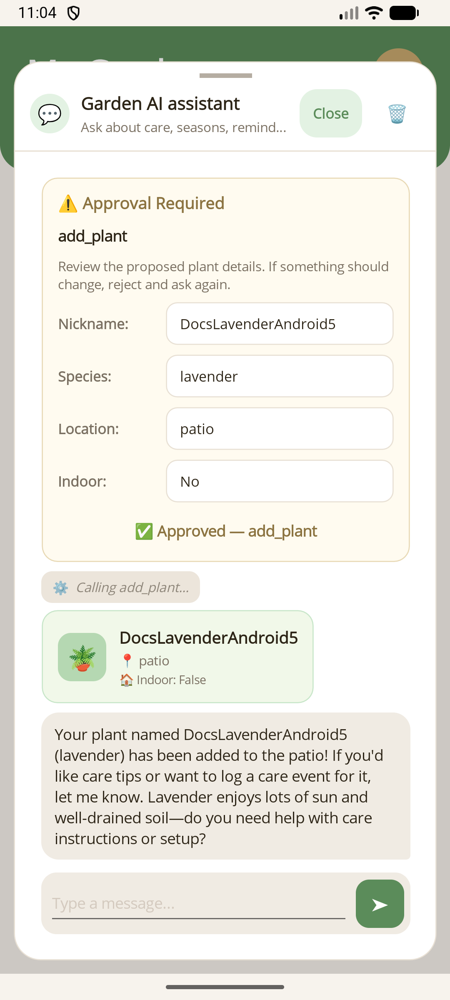

# MauiAIAnnotations

Turn regular .NET MAUI services into AI-callable tools and add a reusable chat UI without hand-writing JSON schemas or tool adapters.

`MauiAIAnnotations` handles **reflection-based tool discovery** and schema generation.  
`MauiAIAnnotations.Maui` adds the **chat panel, content templates, and approval UI**.

| Windows | Android |
| --- | --- |
|  |  |

## Start here

Choose the path that matches what you need:

| Path | Best for | Guide |
| --- | --- | --- |
| **Quick start** | Add AI chat + function calling to an existing MAUI page fast | [Getting Started](docs/getting-started.md) |
| **Approval flow** | Require approve/reject before sensitive tools run | [Human-in-the-Loop Approval](docs/human-in-the-loop.md) |
| **Tool result views** | Start with the default result view, then replace it with cards or widgets when needed | [Custom Tool Rendering](docs/tool-rendering.md) |

### What each path looks like

**Quick start - chat + tool calls**

| Windows | Android |
| --- | --- |
|  |  |

**Approval flow - review before execution**

| Windows | Android |
| --- | --- |
|  |  |

**Rich tool UI - custom result cards**

| Windows | Android |
| --- | --- |
|  |  |

## Quick start in 3 steps

### 1. Annotate your service methods

```csharp
using MauiAIAnnotations;
using System.ComponentModel;

public class PlantDataService
{
    [ExportAIFunction("get_plants", Description = "Gets all plants the user has registered.")]
    public async Task<List<Plant>> GetPlantsAsync() => ...;

    [ExportAIFunction(
        "add_plant",
        Description = "Adds a new plant to the garden.",
        ApprovalRequired = true)]
    public async Task<Plant> AddPlantAsync(
        [Description("A friendly name for the plant")] string nickname,
        [Description("The species name")] string species) => ...;
}
```

### 2. Register tools and build the MEAI chat pipeline

```csharp
builder.Services.AddSingleton<PlantDataService>();
builder.Services.AddAITools(typeof(PlantDataService).Assembly);
builder.Services.AddAIChat();

builder.Services.AddSingleton<IChatClient>(provider =>
{
    return openAiChatClient
        .AsIChatClient()
        .AsBuilder()
        .UseMauiToolApproval()
        .UseFunctionInvocation()
        .Build(provider);
});
```

> Keep `UseMauiToolApproval()` before `UseFunctionInvocation()` so approval-required tools can pause and resume correctly.

### 3. Drop the chat panel onto your page

```xml
<maui:ChatPanelControl ChatVM="{Binding ChatViewModel}">
    <maui:ChatPanelControl.ContentTemplates>
        <mauiChat:TextContentTemplate Role="User" />
        <mauiChat:TextContentTemplate Role="Assistant" />
        <mauiChat:FunctionCallTemplate />
        <mauiChat:FunctionResultTemplate />
        <mauiChat:ToolApprovalTemplate />
        <mauiChat:ErrorContentTemplate />
        <mauiChat:DefaultContentTemplate />
    </maui:ChatPanelControl.ContentTemplates>
</maui:ChatPanelControl>
```

The built-in templates already provide the standard MAUI views. Add a custom `ViewType` only when you want a richer renderer for a specific tool or result.

## When you want more than the basics

- **Need a guided first integration?** Start with [Getting Started](docs/getting-started.md).
- **Need review-before-run for writes/deletes?** Use [Human-in-the-Loop Approval](docs/human-in-the-loop.md).
- **Need the default tool result view or a custom one?** Use [Custom Tool Rendering](docs/tool-rendering.md).
- **Need a working reference app?** See [`samples/MauiSampleApp`](samples/MauiSampleApp).

## Packages

| Package | Description |
| --- | --- |
| `MauiAIAnnotations` | Attribute-based AI tool discovery for `Microsoft.Extensions.AI` |
| `MauiAIAnnotations.Maui` | Reusable MAUI chat UI, content templates, and approval dialogs |

## Requirements

- .NET 10.0+
- `Microsoft.Extensions.AI` 10.4.1+
- `Microsoft.Extensions.DependencyInjection` 10.0.0+

## License

See [LICENSE](LICENSE) for details.
