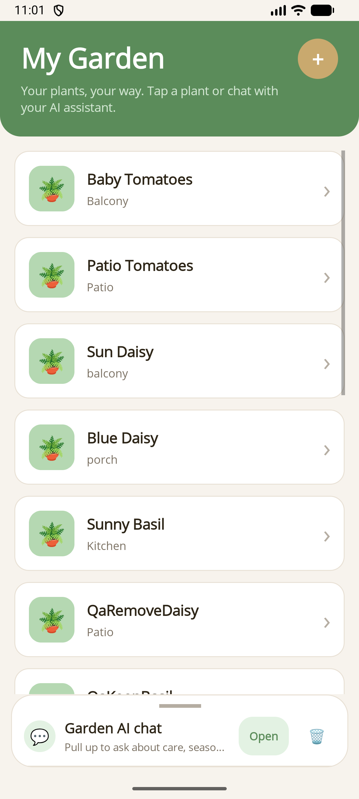

# Microsoft.Extensions.AI Attributes / Chat / Maui

Turn regular .NET services into AI-callable tools and host them in a reusable MAUI chat experience without hand-writing JSON schemas or tool adapters.

`Microsoft.Extensions.AI.Attributes` handles **reflection-based tool discovery** and DI registration.  
`Microsoft.Extensions.AI.Chat` adds the **headless `ChatSession` engine** and approval-aware conversation flow.  
`Microsoft.Extensions.AI.Maui` adds the **thin MAUI chat panel, content templates, and approval UI** on top.

| Windows | Android |
| --- | --- |
|  |  |

## Quick start

### 1. Annotate your service methods

```csharp
using Microsoft.Extensions.AI.Attributes;
using System.ComponentModel;

public class PlantDataService
{
    [Description("Gets all plants the user has registered.")]
    [ExportAIFunction("get_plants")]
    public async Task<List<Plant>> GetPlantsAsync() => ...;
}
```

### 2. Register tools and chat

```csharp
builder.Services.AddSingleton<PlantDataService>();
builder.Services.AddAITools(typeof(PlantDataService).Assembly);
builder.Services.AddChatSession(ServiceLifetime.Transient);
```

### 3. Add the MAUI panel

```xml
<maui:ChatPanelControl Session="{Binding ChatSession}">
    <maui:ChatPanelControl.ContentTemplates>
        <mauiChat:TextContentTemplate Role="User" />
        <mauiChat:TextContentTemplate Role="Assistant" />
        <mauiChat:FunctionCallTemplate />
        <mauiChat:FunctionResultTemplate />
        <mauiChat:ToolApprovalTemplate />
        <mauiChat:ErrorContentTemplate />
        <mauiChat:DefaultContentTemplate />
    </maui:ChatPanelControl.ContentTemplates>
</maui:ChatPanelControl>
```

## Packages

| Package | Description |
| --- | --- |
| `Microsoft.Extensions.AI.Attributes` | Attribute-based AI tool discovery and `AddAITools()` registration |
| `Microsoft.Extensions.AI.Chat` | Headless `ChatSession`, transcript types, and approval-aware chat flow |
| `Microsoft.Extensions.AI.Maui` | Reusable MAUI chat UI, content templates, and approval dialogs |

See [docs/README.md](docs/README.md) for the full walkthrough and sample app guidance.
