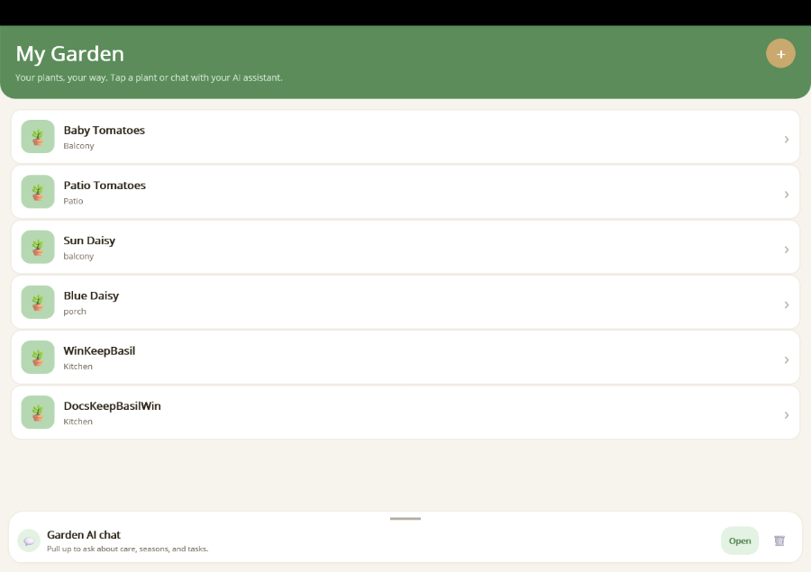

# MauiAIAnnotations

A .NET 10 library that makes it easy to expose service methods as AI tools and build chat-powered MAUI apps — with zero boilerplate.



## Packages

| Package | Description |
|---------|-------------|
| **MauiAIAnnotations** | Attribute-based AI tool discovery. Decorate methods with `[ExportAIFunction]` and call `AddAITools()` to register them in DI. |
| **MauiAIAnnotations.Maui** | Reusable MAUI chat UI — `ChatSidebarControl`, content template system, and human-in-the-loop approval dialogs. |

## Key Features

- **Zero-config tool discovery** — Annotate methods with `[ExportAIFunction]` and scan assemblies automatically. No manual registration.
- **Reusable chat sidebar/overlay** — Drop `ChatSidebarControl` into any MAUI page for a ready-made AI chat experience.
- **Pluggable content templates** — Register `DataTemplate` renderers for custom tool result types (e.g., plant cards, weather widgets).
- **Human-in-the-loop approval** — Set `ApprovalRequired = true` on any tool to gate execution behind user confirmation.

## Quick Example

The minimal 3-step pattern to wire up AI tools in a gardening app:

### 1. Annotate your service methods

```csharp
public class PlantDataService
{
    [ExportAIFunction("get_plants", Description = "Gets all plants the user has registered.")]
    public async Task<List<Plant>> GetPlantsAsync() { ... }

    [ExportAIFunction("add_plant",
        Description = "Adds a new plant to the garden.",
        ApprovalRequired = true)]
    public async Task<Plant> AddPlantAsync(
        [Description("A friendly name for the plant")] string nickname,
        [Description("The species name")] string species) { ... }
}
```

### 2. Register in DI

```csharp
builder.Services.AddSingleton<PlantDataService>();
builder.Services.AddAITools(typeof(PlantDataService).Assembly);
```

### 3. Inject and use

```csharp
public class ChatViewModel
{
    private readonly IList<AITool> _tools;
    private readonly IChatClient _chatClient;

    public ChatViewModel(IEnumerable<AITool> tools, IChatClient chatClient)
    {
        _tools = tools.ToList();
        _chatClient = chatClient;
    }

    async Task SendAsync(string message)
    {
        var options = new ChatOptions { Tools = _tools };
        await foreach (var update in _chatClient.GetStreamingResponseAsync(messages, options))
        {
            // handle streaming response
        }
    }
}
```

## Guides

| Guide | Description |
|-------|-------------|
| [Getting Started](getting-started.md) | Install packages, configure DI, and send your first AI chat message. |
| [Custom Tool Rendering](tool-rendering.md) | Register `DataTemplate` renderers so tool results display as rich UI. |
| [Human-in-the-Loop Approvals](human-in-the-loop.md) | Gate destructive operations behind user confirmation dialogs. |

## Requirements

- .NET 10.0+
- `Microsoft.Extensions.AI` 10.4.1+
- `Microsoft.Extensions.DependencyInjection` 10.0.0+

## License

See [LICENSE](../LICENSE) for details.
