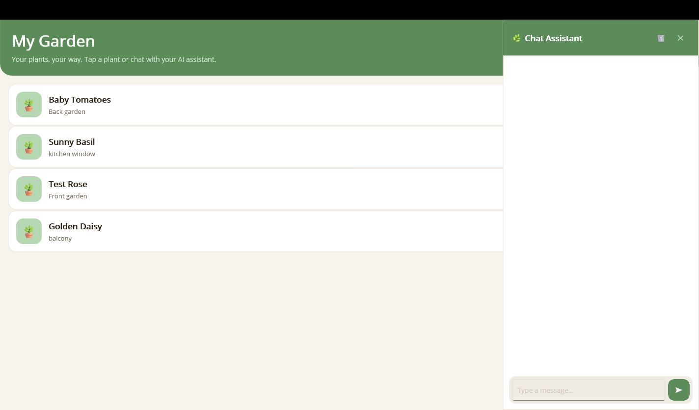
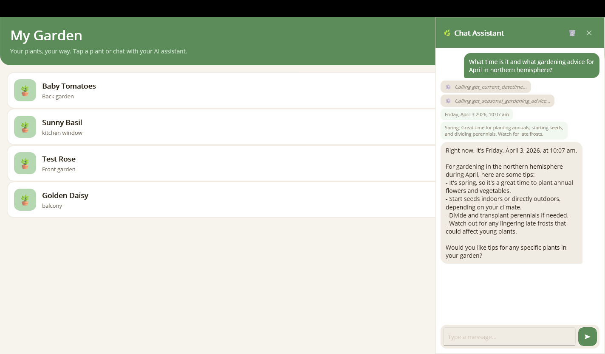

# Getting Started with MauiAIAnnotations

Add AI chat functionality to your existing .NET MAUI app in minutes. This guide walks you through the minimum steps to get a working AI chat sidebar with function calling.

## Prerequisites

- An existing .NET MAUI application
- An Azure OpenAI (or OpenAI) deployment endpoint and API key

## Step 1: Install NuGet Packages

From your MAUI project directory, add the required packages:

```bash
dotnet add package MauiAIAnnotations
dotnet add package MauiAIAnnotations.Maui
dotnet add package Microsoft.Extensions.AI
dotnet add package Microsoft.Extensions.AI.OpenAI
dotnet add package Azure.AI.OpenAI
```

## Step 2: Annotate Your Service Methods

Add `[ExportAIFunction]` to any service methods you want the AI to call. Use `[Description]` on parameters so the model understands what each argument means.

```csharp
using MauiAIAnnotations;
using System.ComponentModel;

public class PlantDataService
{
    [ExportAIFunction("get_plants", Description = "Gets all plants.")]
    public async Task<List<Plant>> GetPlantsAsync()
    {
        // your existing data access logic
    }

    [ExportAIFunction("add_plant", Description = "Adds a new plant.")]
    public async Task<Plant> AddPlantAsync(
        [Description("A friendly name for the plant")] string nickname,
        [Description("The species of the plant")] string species)
    {
        // your existing data access logic
    }
}
```

That's it — no manual JSON schema definitions or adapter classes needed. The source generator handles the rest at compile time.

## Step 3: Wire Up DI in MauiProgram.cs

Register your services and the AI chat client in `MauiProgram.cs`:

```csharp
using Microsoft.Extensions.AI;
using Azure.AI.OpenAI;
using System.ClientModel;

// Register your data service
builder.Services.AddSingleton<PlantDataService>();

// Discover all [ExportAIFunction] methods automatically
builder.Services.AddAITools();

// Set up the AI chat client with function invocation
builder.Services.AddSingleton<IChatClient>(provider =>
{
    var client = new AzureOpenAIClient(
        new Uri(endpoint),
        new ApiKeyCredential(apiKey));

    return client
        .GetChatClient(deploymentName)
        .AsIChatClient()
        .AsBuilder()
        .UseFunctionInvocation()
        .Build(provider);
});
```

`AddAITools()` scans your registered services for `[ExportAIFunction]` attributes and makes them available as AI tools. `UseFunctionInvocation()` enables automatic function calling — the AI model can invoke your methods directly during a conversation.

## Step 4: Add the Chat Overlay to Your Page

Add the `ChatOverlayControl` to any XAML page. Include the namespace declarations and content template mappings:

```xml
xmlns:maui="clr-namespace:MauiAIAnnotations.Maui;assembly=MauiAIAnnotations.Maui"
xmlns:mauiChat="clr-namespace:MauiAIAnnotations.Maui.Chat;assembly=MauiAIAnnotations.Maui"
```

```xml
<maui:ChatOverlayControl ChatVM="{Binding ChatViewModel}">
    <maui:ChatOverlayControl.ContentTemplates>
        <mauiChat:TextContentMapping Role="User"
            ViewType="{x:Type mauiChat:UserTextView}" />
        <mauiChat:TextContentMapping Role="Assistant"
            ViewType="{x:Type mauiChat:AssistantTextView}" />
        <mauiChat:FunctionCallMapping
            ViewType="{x:Type mauiChat:FunctionCallView}" />
        <mauiChat:FunctionResultMapping
            ViewType="{x:Type mauiChat:FunctionResultView}" />
        <mauiChat:ErrorContentMapping
            ViewType="{x:Type mauiChat:ErrorView}" />
        <mauiChat:DefaultContentMapping
            ViewType="{x:Type mauiChat:DefaultContentView}" />
    </maui:ChatOverlayControl.ContentTemplates>
</maui:ChatOverlayControl>
```

Run the app and you'll see the chat interface:



Ask the AI a question like *"Show me all my plants"* and watch it invoke your annotated methods automatically:



## Step 5: How It Works

- **Responsive layout** — on wide screens (≥900px), chat appears as a sidebar; on narrow screens, it's a floating overlay with a FAB button.
- **Automatic function invocation** — `FunctionInvokingChatClient` intercepts tool-call responses from the model and dispatches them to your `[ExportAIFunction]` methods.
- **Visual message templates** — each message type (user text, assistant text, function call, function result, error) gets its own visual template via the content mappings above.
- **Source-generated tools** — `AddAITools()` discovers tool definitions created at compile time, so there's no reflection overhead at runtime.

## Next Steps

- [Tool Rendering](tool-rendering.md) — customize how function calls and results are displayed in the chat UI.
- [Human-in-the-Loop](human-in-the-loop.md) — add confirmation prompts before the AI executes sensitive operations.
