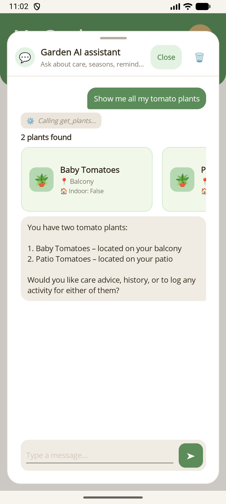

# Getting Started with MauiAIAnnotations

Add AI chat functionality to your existing .NET MAUI app in minutes. This is the **fastest path** to a working chat experience with function calling.

## Choose Your Path

- **You want the fastest working setup** - stay in this guide.
- **You need approve/reject before writes or deletes run** - jump to [Human-in-the-Loop Approval](human-in-the-loop.md).
- **You want rich cards or custom views for tool results** - jump to [Custom Tool Result Rendering](tool-rendering.md).

## Prerequisites

- An existing .NET MAUI application
- An Azure OpenAI (or OpenAI) deployment endpoint and API key

## Step 1: Install NuGet Packages

From your MAUI project directory, add the required packages:

```bash
dotnet add package MauiAIAnnotations
dotnet add package MauiAIAnnotations.Maui
dotnet add package Microsoft.Extensions.AI
dotnet add package Microsoft.Extensions.AI.OpenAI
dotnet add package Azure.AI.OpenAI
```

## Step 2: Annotate Your Service Methods

Add `[ExportAIFunction]` to any service methods you want the AI to call. Use `[Description]` on the method and its parameters so the model gets a cleaner, more readable summary of what the tool does and what each argument means.

```csharp
using MauiAIAnnotations;
using System.ComponentModel;

public class PlantDataService
{
    [Description("Gets all plants.")]
    [ExportAIFunction("get_plants")]
    public async Task<List<Plant>> GetPlantsAsync()
    {
        // your existing data access logic
    }

    [Description("Adds a new plant.")]
    [ExportAIFunction("add_plant")]
    public async Task<Plant> AddPlantAsync(
        [Description("A friendly name for the plant")] string nickname,
        [Description("The species of the plant")] string species)
    {
        // your existing data access logic
    }
}
```

That's it — no manual JSON schema definitions or adapter classes needed. The library handles discovery via reflection at registration time.

## Step 3: Wire Up DI in MauiProgram.cs

Register your services and the AI chat client in `MauiProgram.cs`:

```csharp
using MauiAIAnnotations;
using Microsoft.Extensions.AI;
using Azure.AI.OpenAI;
using System.ClientModel;

// Register your data service
builder.Services.AddSingleton<PlantDataService>();

// Discover all [ExportAIFunction] methods automatically
builder.Services.AddAITools();

// Set up the AI chat client with function invocation
builder.Services.AddSingleton<IChatClient>(provider =>
{
    var client = new AzureOpenAIClient(
        new Uri(endpoint),
        new ApiKeyCredential(apiKey));

    return client
        .GetChatClient(deploymentName)
        .AsIChatClient()
        .AsBuilder()
        .UseFunctionInvocation()
        .Build(provider);
});
```

`AddAITools()` scans your registered services for `[ExportAIFunction]` attributes and makes them available as AI tools. `UseFunctionInvocation()` enables automatic function calling. For tools marked with `ApprovalRequired = true`, the chat session surfaces a `ToolApprovalRequestContent`, the turn ends cleanly, and the conversation continues when the user later approves or rejects that request.

> **Note:** `endpoint`, `apiKey`, and `deploymentName` should come from configuration
> (e.g. `builder.Configuration` or user secrets). See the sample app's `MauiProgram.cs`
> for a full example using `AddJsonStream` for embedded secrets.

You'll also need a session object for the page to bind to. The library provides
`MauiAIAnnotations.Maui.Chat.ChatSession` — `AddAIChat()` registers it for you:

```csharp
builder.Services.AddAIChat(ServiceLifetime.Transient);
builder.Services.AddTransient<HomePage>();
```

```csharp
// HomePage.xaml.cs
public ChatSession ChatSession { get; }

public HomePage(ChatSession chatSession)
{
    ChatSession = chatSession;
    InitializeComponent();
}
```

## Step 4: Add the Chat Overlay to Your Page

Add the `ChatPanelControl` to any XAML page. Include the namespace declarations and content template mappings:

```xml
xmlns:maui="clr-namespace:MauiAIAnnotations.Maui.Controls;assembly=MauiAIAnnotations.Maui"
xmlns:mauiChat="clr-namespace:MauiAIAnnotations.Maui.Chat;assembly=MauiAIAnnotations.Maui"
```

```xml
<maui:ChatPanelControl ItemsSource="{Binding ChatSession.Messages}"
                       Text="{Binding ChatSession.UserInput, Mode=TwoWay}"
                       SendCommand="{Binding ChatSession.SendCommand}"
                       IsBusy="{Binding ChatSession.IsBusy}">
    <maui:ChatPanelControl.ContentTemplates>
        <mauiChat:TextContentTemplate Role="User" />
        <mauiChat:TextContentTemplate Role="Assistant" />
        <mauiChat:FunctionCallTemplate />
        <mauiChat:FunctionResultTemplate />
        <mauiChat:ToolApprovalTemplate />
        <mauiChat:ErrorContentTemplate />
        <mauiChat:DefaultContentTemplate />
    </maui:ChatPanelControl.ContentTemplates>
</maui:ChatPanelControl>
```

The built-in templates already provide the default MAUI views, including the standard approve/reject card for `ApprovalRequired = true` tools. `ChatSession` is the starter state object; `ChatPanelControl` itself binds through `ItemsSource`, `Text`, `SendCommand`, and `IsBusy`. The older `ChatViewModel` still exists for compatibility, but new code should prefer `ChatSession`. For both the default-view path and the custom-view path, see [Tool Rendering](tool-rendering.md).

Run the app and you'll see the chat interface:

| Windows | Android |
| --- | --- |
|  |  |

Ask the AI a question like *"Show me all my plants"* and watch it invoke your annotated methods automatically:

| Windows | Android |
| --- | --- |
|  |  |

## Step 5: How It Works

- **Host-controlled layout** — place `ChatPanelControl` wherever it fits your page: inline, in a tray, or as a sidebar on wider screens.
- **Automatic function invocation** — `FunctionInvokingChatClient` intercepts tool-call responses from the model and dispatches them to your `[ExportAIFunction]` methods.
- **Visual message templates** — each message type (user text, assistant text, function call, function result, error) gets its own visual template via the content mappings above.
- **DI-integrated tools** — `AddAITools()` discovers tool definitions at registration time via reflection, respecting DI lifetimes for each invocation.

## Next Steps

- [Tool Rendering](tool-rendering.md) — customize how function calls and results are displayed in the chat UI.
- [Human-in-the-Loop](human-in-the-loop.md) — add confirmation prompts before the AI executes sensitive operations.
