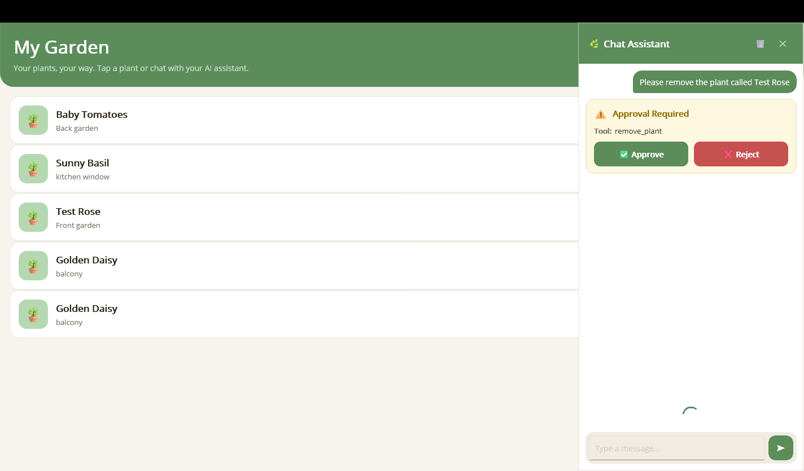
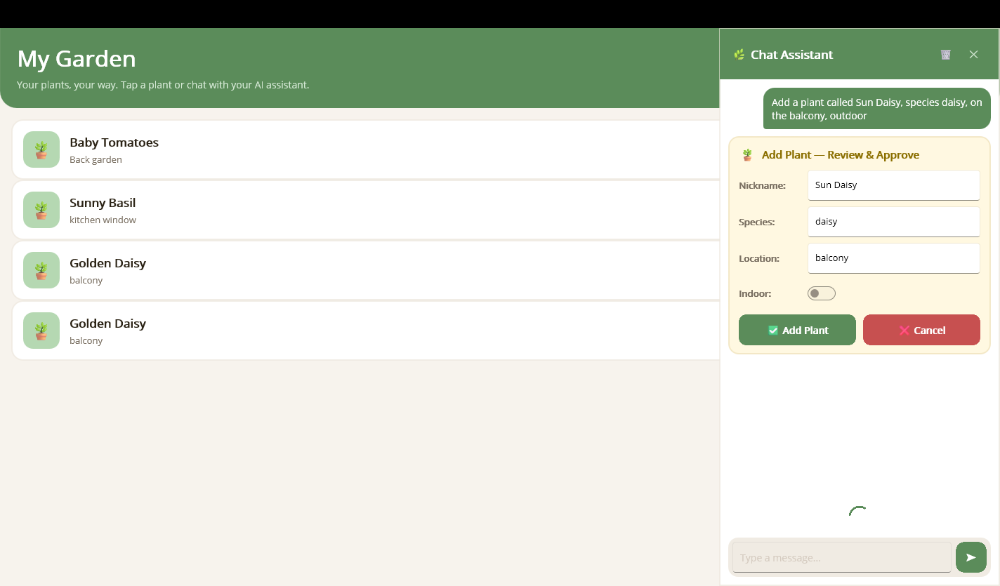
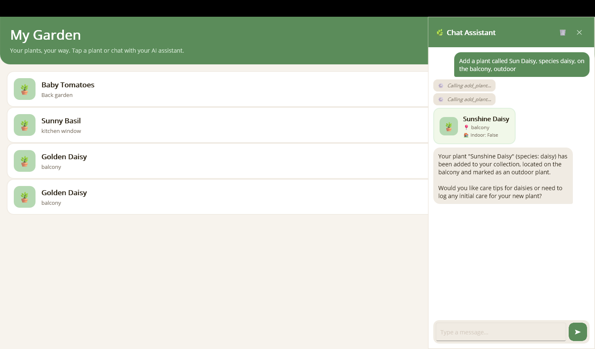
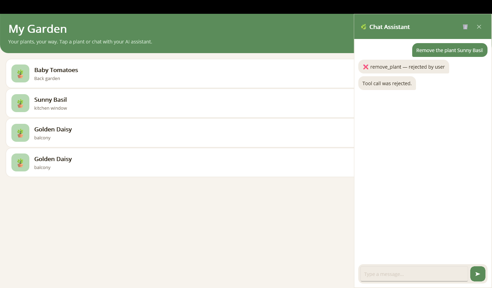

# Human-in-the-Loop Approval

## Overview

Some AI tool calls are too sensitive to auto-execute — adding, deleting, or modifying
data should require explicit user consent. The `[ExportAIFunction]` attribute supports
an `ApprovalRequired` flag that tells the system to pause and present an approval card
before the tool is invoked. The user can review the arguments, optionally edit them,
and then approve or reject the action.

## How It Works

1. **Mark the method** — Set `ApprovalRequired = true` on the `[ExportAIFunction]` attribute.
2. **Discovery wraps it** — When `AddAITools()` discovers the function, it wraps it in
   an `ApprovalRequiredAIFunction` (from `Microsoft.Extensions.AI`).
3. **Chat client yields an approval request** — `FunctionInvokingChatClient` recognises
   the wrapper and emits a `ToolApprovalRequestContent` instead of auto-invoking.
4. **ViewModel pauses the conversation** — `ChatViewModel` detects the approval request,
   pauses streaming, and surfaces the request in the chat UI.
5. **User reviews & decides** — The user sees an approval card where they can inspect
   (and optionally edit) the arguments, then tap **Approve** or **Reject**.
6. **Result flows back** — On approval the tool executes with the (possibly modified)
   arguments. On rejection the tool is skipped and the AI is informed.

## Step 1: Mark Sensitive Tools

Add `ApprovalRequired = true` to any tool that mutates data:

```csharp
[ExportAIFunction("add_plant", Description = "Adds a new plant.", ApprovalRequired = true)]
public async Task<Plant> AddPlantAsync(
    [Description("A friendly name for the plant")] string nickname,
    [Description("The species name")] string species,
    [Description("Where the plant is located")] string location,
    [Description("Whether the plant is kept indoors")] bool isIndoor) { ... }

[ExportAIFunction("remove_plant", Description = "Removes a plant.", ApprovalRequired = true)]
public async Task RemovePlantAsync(
    [Description("The nickname of the plant to remove")] string nickname) { ... }
```

That's it — no changes to `MauiProgram.cs` are needed. The discovery pipeline handles
the wrapping automatically.

## Step 2: Register the Approval Template

The library ships with a generic `ToolApprovalView` that works for any tool. Register
it as a chat item template so the chat UI knows how to render approval requests:

```xml
<mauiChat:ToolApprovalMapping ViewType="{x:Type mauiChat:ToolApprovalView}" />
```

This displays a card with the tool name, a read-only summary of the arguments, and
**Approve** / **Reject** buttons.



## Step 3: (Optional) Create a Custom Approval View

For a richer experience you can create tool-specific approval views that let the user
edit individual arguments before approving.

### 1. Create a custom mapping

Create a `PlantApprovalMapping` class that matches only the `add_plant` tool.
It inherits from `ContentTemplateMapping` and overrides `When()`:

```csharp
using MauiAIAnnotations.Maui.Chat;
using Microsoft.Extensions.AI;

public class PlantApprovalMapping : ContentTemplateMapping
{
    public override bool When(ContentContext context) =>
        context.Content is ToolApprovalRequestContent approval &&
        approval.ToolCall is FunctionCallContent fc &&
        string.Equals(fc.Name, "add_plant", StringComparison.OrdinalIgnoreCase);
}
```

### 2. Create a view-model with editable properties

```csharp
using CommunityToolkit.Mvvm.ComponentModel;
using MauiAIAnnotations.Maui.Chat;
using Microsoft.Extensions.AI;

public partial class PlantApprovalViewModel : ObservableObject
{
    [ObservableProperty]
    public partial string Nickname { get; set; }

    [ObservableProperty]
    public partial string Species { get; set; }

    [ObservableProperty]
    public partial string Location { get; set; }

    [ObservableProperty]
    public partial bool IsIndoor { get; set; }

    public ToolApprovalRequestContent? Request { get; private set; }

    public void SetContext(ContentContext context)
    {
        if (context.Content is not ToolApprovalRequestContent approval ||
            approval.ToolCall is not FunctionCallContent fc)
            return;

        Request = approval;
        var args = fc.Arguments;
        if (args is null) return;

        Nickname = args.TryGetValue("nickname", out var n) ? n?.ToString() ?? "" : "";
        Species = args.TryGetValue("species", out var s) ? s?.ToString() ?? "" : "";
        Location = args.TryGetValue("location", out var l) ? l?.ToString() ?? "" : "";
        IsIndoor = args.TryGetValue("isIndoor", out var i) && i is true;
    }

    public IDictionary<string, object?> BuildArguments() => new Dictionary<string, object?>
    {
        ["nickname"] = Nickname,
        ["species"] = Species,
        ["location"] = Location,
        ["isIndoor"] = IsIndoor,
    };
}
```

### 3. Create the XAML view

The view uses compiled bindings with `x:DataType` and walks the visual tree to find
`ChatViewModel` for responding. See the full implementation in
`samples/MauiSampleApp/Chat/Contents/PlantApproval/`.

```xml
<ContentView x:DataType="local:PlantApprovalViewModel">
    <Border Padding="14,12" BackgroundColor="{AppThemeBinding Light=#FFF8E1, Dark=#302A18}">
        <VerticalStackLayout Spacing="10">
            <Label Text="🪴 Add Plant — Review &amp; Approve" FontAttributes="Bold" />
            <Entry Text="{Binding Nickname}" AutomationId="ApprovalNicknameEntry" />
            <Entry Text="{Binding Species}" AutomationId="ApprovalSpeciesEntry" />
            <Entry Text="{Binding Location}" AutomationId="ApprovalLocationEntry" />
            <Switch IsToggled="{Binding IsIndoor}" AutomationId="ApprovalIndoorSwitch" />
            <Grid ColumnDefinitions="*,*" ColumnSpacing="10">
                <Button Text="✅ Add Plant" AutomationId="ApproveToolButton"
                        Clicked="OnApproveClicked" BackgroundColor="#5B8C5A" TextColor="White" />
                <Button Grid.Column="1" Text="❌ Cancel" AutomationId="RejectToolButton"
                        Clicked="OnRejectClicked" BackgroundColor="#C75050" TextColor="White" />
            </Grid>
        </VerticalStackLayout>
    </Border>
</ContentView>
```

### 4. Register before the generic mapping

Order matters — more specific mappings must come first:

```xml
<local:PlantApprovalMapping ViewType="{x:Type local:PlantApprovalView}" />
<mauiChat:ToolApprovalMapping ViewType="{x:Type mauiChat:ToolApprovalView}" />
```

The custom approval view shows editable fields for the plant data:



## After Approval

When the user edits arguments and taps **Approve**, the approval card is replaced
with a normal function call bubble and the tool executes with the modified values.
In the screenshot below the user changed *"Sun Daisy"* to
*"Sunshine Daisy"* before approving — the tool received the updated name.



## After Rejection

When the user taps **Reject**, the approval card is replaced with a
"❌ tool_name — rejected by user" note and the tool is **not** invoked.



## Key Points

- **`ApprovalRequired = true`** is the only change needed in your service code.
- **No `MauiProgram.cs` changes** — the discovery pipeline wraps the function
  automatically.
- **Custom approval views** let users inspect and edit arguments before the tool runs.
- **`ChatViewModel.RespondToApproval()`** supports passing modified arguments back to
  the tool invocation.

> **Full sample code:** See `samples/MauiSampleApp/Chat/Contents/PlantApproval/` for the complete editable plant approval implementation.
