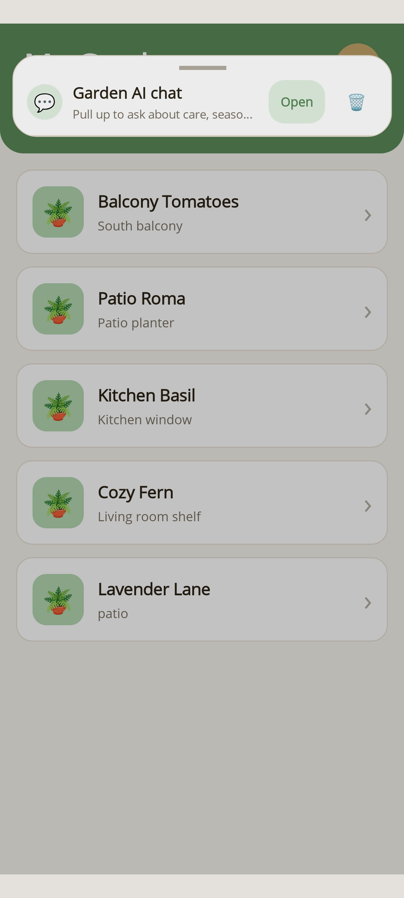
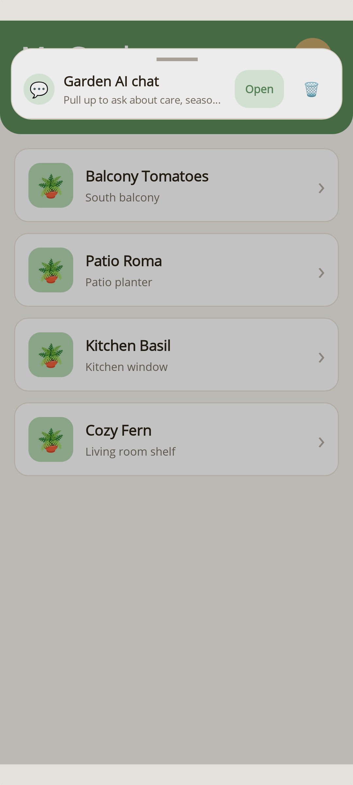
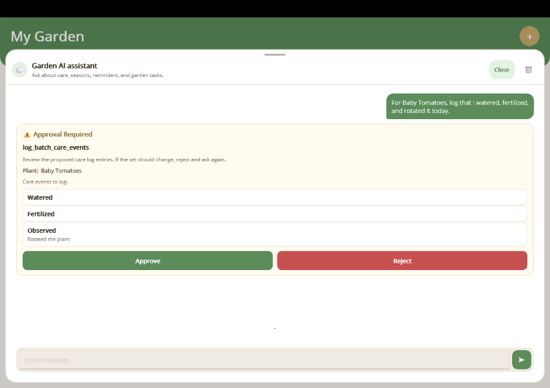

# Human-in-the-Loop Approval

## Overview

Some AI tool calls are too sensitive to auto-execute — adding, deleting, or modifying
data should require explicit user consent. The `[ExportAIFunction]` attribute supports
an `ApprovalRequired` flag that tells the system to surface an approval card before the
tool is invoked. The user can review the arguments, optionally edit them, and then
approve or reject the action in a later turn.

## How It Works

1. **Mark the method** — Set `ApprovalRequired = true` on the `[ExportAIFunction]` attribute.
2. **Discovery wraps it** — When `AddAITools()` discovers the function, it wraps it in
   an `ApprovalRequiredAIFunction` (from `Microsoft.Extensions.AI`).
3. **Chat client yields an approval request** — `FunctionInvokingChatClient` recognises
   the wrapper and emits a `ToolApprovalRequestContent` instead of auto-invoking.
4. **The session stores that request and the turn ends cleanly** — `ChatSession` exposes the
   pending approval while preserving the conversation history for the next turn.
5. **User reviews & decides** — The user sees an approval card where they can inspect
   (and optionally edit) the arguments, then tap **Approve** or **Reject**.
6. **The session resumes the conversation** — On approval the tool executes with the
   (possibly modified) arguments. On rejection the tool is skipped and the AI is informed.

## Step 1: Mark Sensitive Tools

Add `ApprovalRequired = true` to any tool that mutates data:

```csharp
[Description("Adds a new plant.")]
[ExportAIFunction("add_plant", ApprovalRequired = true)]
public async Task<Plant> AddPlantAsync(
    [Description("A friendly name for the plant")] string nickname,
    [Description("The species name")] string species,
    [Description("Where the plant is located")] string location,
    [Description("Whether the plant is kept indoors")] bool isIndoor) { ... }

[Description("Removes a plant.")]
[ExportAIFunction("remove_plant", ApprovalRequired = true)]
public async Task RemovePlantAsync(
    [Description("The nickname of the plant to remove")] string nickname) { ... }
```

The discovery pipeline handles the wrapping automatically. The recommended chat setup keeps
the approval flow explicit and turn-based:

```csharp
builder.Services.AddSingleton<IChatClient>(provider =>
{
    var loggerFactory = provider.GetRequiredService<ILoggerFactory>();

    return openAiChatClient
        .AsIChatClient()
        .AsBuilder()
        .UseLogging(loggerFactory)
        .UseFunctionInvocation()
        .Build(provider);
});
```

If you still want the older one-call, in-memory wait/resume behavior for a simple local sample,
`UseMauiToolApproval()` remains available as a legacy opt-in. The recommended framework path,
though, is the `ChatSession`-driven request/response model above.

## Step 2: Register the Approval Template

The library ships with a generic `ToolApprovalView` that works for any tool. Register
it as a chat item template so the chat UI knows how to render approval requests:

```xml
<mauiChat:ToolApprovalTemplate ViewType="{x:Type mauiChat:ToolApprovalView}" />
```

This displays a card with the tool name, a read-only summary of the arguments, and
**Approve** / **Reject** buttons.

| Windows | Android |
| --- | --- |
|  |  |

## Step 3: (Optional) Create a Custom Approval View

For a richer experience you can create tool-specific approval views. The built-in shell
is still review-first by default, but a custom view or view-model can optionally return
an edited `ToolApprovalResponseContent` if you want edit-before-run behavior.

### 1. Create a custom mapping

Create a `PlantApprovalMapping` class that matches only the `add_plant` tool.
It inherits from `ContentTemplate` and overrides `When()`:

```csharp
using MauiAIAnnotations.Maui.Chat;
using Microsoft.Extensions.AI;

public class PlantApprovalMapping : ContentTemplate
{
    public override bool When(ContentContext context) =>
        context.Content is ToolApprovalRequestContent approval &&
        approval.ToolCall is FunctionCallContent fc &&
        string.Equals(fc.Name, "add_plant", StringComparison.OrdinalIgnoreCase);
}
```

### 2. Create a view-model with review properties

```csharp
using CommunityToolkit.Mvvm.ComponentModel;
using MauiAIAnnotations.Maui.Chat;
using Microsoft.Extensions.AI;

public partial class PlantApprovalViewModel : ObservableObject, IContentContextAware
{
    [ObservableProperty]
    public partial string Nickname { get; set; }

    [ObservableProperty]
    public partial string Species { get; set; }

    [ObservableProperty]
    public partial string Location { get; set; }

    [ObservableProperty]
    public partial bool IsIndoor { get; set; }

    public ToolApprovalRequestContent? Request { get; private set; }

    public void ApplyContentContext(ContentContext context)
    {
        if (context.Content is not ToolApprovalRequestContent approval ||
            approval.ToolCall is not FunctionCallContent fc)
            return;

        Request = approval;
        var args = fc.Arguments;
        if (args is null) return;

        Nickname = args.TryGetValue("nickname", out var n) ? n?.ToString() ?? "" : "";
        Species = args.TryGetValue("species", out var s) ? s?.ToString() ?? "" : "";
        Location = args.TryGetValue("location", out var l) ? l?.ToString() ?? "" : "";
        IsIndoor = args.TryGetValue("isIndoor", out var i) && i is true;
    }

public string IndoorDisplay => IsIndoor ? "Yes" : "No";
}
```

If you want the custom view-model to submit edited values instead of the original tool
call, implement `IToolApprovalResponseFactory` as well:

```csharp
using MauiAIAnnotations.Maui.Chat;
using Microsoft.Extensions.AI;

public ToolApprovalResponseContent CreateApprovalResponse(
    ToolApprovalRequestContent request,
    bool approved)
{
    var originalCall = (FunctionCallContent)request.ToolCall;
    var editedCall = new FunctionCallContent(
        originalCall.CallId,
        originalCall.Name,
        new Dictionary<string, object?>
        {
            ["nickname"] = Nickname,
            ["species"] = Species,
            ["location"] = Location,
            ["isIndoor"] = IsIndoor,
        });

    return new ToolApprovalResponseContent(request.RequestId, approved, editedCall)
    {
        Reason = approved ? null : "User rejected"
    };
}
```

### 3. Create the XAML view

The view uses compiled bindings with `x:DataType`. The built-in `ToolApprovalView`
continues to own the approve/reject buttons and approval submission; your custom view
only needs to render the review fields (and optionally implement
`IToolApprovalResponseFactory` if it wants to return edited arguments). See the full implementation in
`samples/MauiSampleApp/Chat/Contents/PlantApproval/`.

```xml
<ContentView x:DataType="local:PlantApprovalViewModel">
    <VerticalStackLayout Spacing="10">
        <Label Text="Review the proposed plant details. If something should change, reject and ask again." />
        <Label Text="{Binding Nickname}" AutomationId="ApprovalNicknameEntry" />
        <Label Text="{Binding Species}" AutomationId="ApprovalSpeciesEntry" />
        <Label Text="{Binding Location}" AutomationId="ApprovalLocationEntry" />
        <Label Text="{Binding IndoorDisplay}" AutomationId="ApprovalIndoorSwitch" />
    </VerticalStackLayout>
</ContentView>
```

### 4. Register before the generic mapping

Order matters — more specific mappings must come first:

```xml
<local:PlantApprovalMapping ViewType="{x:Type local:PlantApprovalView}" />
<mauiChat:ToolApprovalTemplate ViewType="{x:Type mauiChat:ToolApprovalView}" />
```

The custom approval view shows review-only plant details:

| Windows | Android |
| --- | --- |
|  |  |

## After Approval

When the user taps **Approve**, the tool executes with the proposed values and the
approval card stays in chat with a resolved status. If something should change,
the user rejects and asks again instead of mutating arguments inside the approval UI.

| Windows | Android |
| --- | --- |
|  |  |

## After Resolution

After approval or rejection, the card **stays visible but is disabled** — inputs become
read-only and the buttons are replaced with a status message. Chat history is preserved.

## After Rejection

When the user taps **Reject**, the buttons are replaced with
"❌ Rejected — tool_name" and the tool is **not** invoked.

| Windows | Android |
| --- | --- |
|  |  |

## Batch Approval with Checkboxes

For tools that accept arrays (e.g. logging multiple care events at once), prefer
a review-only approval card. If the proposed set should change, reject it and let
the model issue a new tool call or a separate planning step.

| Windows | Android |
| --- | --- |
|  |  |

The batch care tool demonstrates this pattern:

```csharp
[ExportAIFunction("log_batch_care_events",
    Description = "Log multiple care events for a plant at once.",
    ApprovalRequired = true)]
public async Task<List<CareEvent>> LogBatchCareEventsAsync(
    string plantNickname, List<string> eventTypes) { ... }
```

Register the checkbox view via `ToolApprovalTemplate.ViewType`:

```xml
<mauiChat:ToolApprovalTemplate ToolName="log_batch_care_events"
    ViewType="{x:Type local:BatchCareApprovalView}" />
```

## Key Points

- **`ApprovalRequired = true`** is the only change needed in your service code.
- **No `MauiProgram.cs` changes** — the discovery pipeline wraps the function
  automatically.
- **Library owns the Approve/Reject buttons** — app views only provide the
  read-only review content for the request.
- **Cards stay after resolution** — the review details remain visible and the
  buttons are replaced with a status message.
- **`ToolApprovalTemplate.ViewType`** — declare custom content per tool name. The library still wraps it in the built-in approval shell.
- **Approve/reject only** — if the proposed details need to change, reject and
  let the model issue a new tool call rather than mutating arguments in the card.

> **Full sample code:** See `samples/MauiSampleApp/Chat/Contents/PlantApproval/` for
> the review-only plant approval and `samples/MauiSampleApp/Chat/Contents/BatchCareApproval/`
> for the review-only batch approval.
