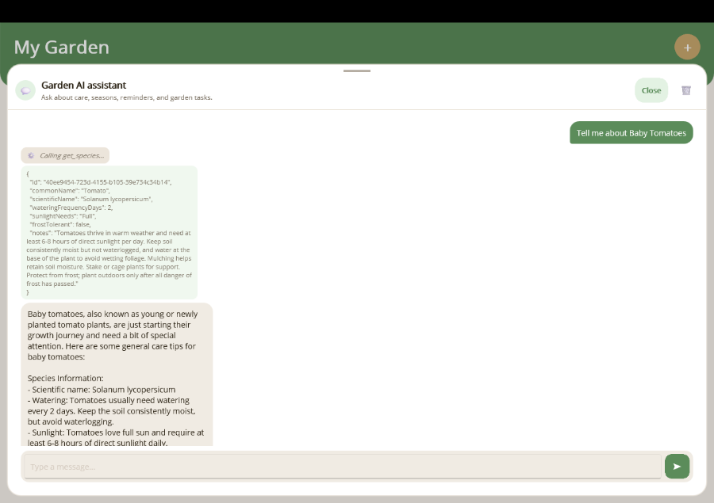

# Custom Tool Result Rendering

By default, function results appear as plain text in the chat. You can replace that with a rich, styled view — a plant card, a weather widget, a product tile — by creating a **content template mapping** that targets specific tool results.

This guide walks through the sample app's `PlantCardView`: when the AI returns a `Plant` from any tool call (e.g. `get_plant`), a styled card appears instead of raw JSON.

## How Content Templates Work

The chat UI uses a `ContentTemplateSelector` that holds an ordered list of `ContentTemplate` objects. For each chat item it iterates the list and picks the **first** mapping whose `When()` predicate returns `true`.

```
ContentTemplateSelector
  ├─ PlantResultTemplate      → PlantResultView   ← matches Plant results
  ├─ FunctionResultTemplate   → FunctionResultView ← catches all other results
  └─ DefaultContentTemplate   → DefaultContentView
```

**Order matters.** Specific mappings must appear before generic ones, otherwise the generic mapping matches first and your custom view is never used.

## Step 1: Create a ContentTemplate

Subclass `ContentTemplate` and override `When()` to match the tool results you care about:

```csharp
using System.Text.Json;
using MauiAIAnnotations.Maui.Chat;
using Microsoft.Extensions.AI;
using MauiSampleApp.Core.Models;

public class PlantResultTemplate : ContentTemplate
{
    public override bool When(ContentContext context)
    {
        if (context.Content is not FunctionResultContent result)
            return false;

        return TryGetPlant(result) is not null;
    }

    public static Plant? TryGetPlant(FunctionResultContent result)
    {
        try
        {
            if (result.Result is Plant plant)
                return plant;

            if (result.Result is JsonElement json)
            {
                return JsonSerializer.Deserialize<Plant>(json.GetRawText(),
                    new JsonSerializerOptions { PropertyNameCaseInsensitive = true });
            }
        }
        catch
        {
            // Not a Plant — fall through to the generic template
        }

        return null;
    }
}
```

The `TryGetPlant` helper handles both strongly-typed returns and JSON payloads, which is common when the AI serializes results.

## Step 2: Create a ViewModel (Optional)

Built-in library views bind directly to `ContentContext` — no ViewModel required. But when your view needs to **extract or transform** data from the AI response, a small ViewModel keeps the view clean:

```csharp
public partial class PlantResultViewModel : ObservableObject
{
    [ObservableProperty]
    public partial Plant? Plant { get; set; }

    public void SetContext(ContentContext context)
    {
        if (context.Content is FunctionResultContent result)
        {
            Plant = PlantResultTemplate.TryGetPlant(result);
        }
    }
}
```

## Step 3: Create the XAML View

The view receives a `ContentContext` as its `BindingContext`. The code-behind creates the ViewModel and wires it up:

```xml
<ContentView x:Class="MauiSampleApp.Chat.PlantResultView">
    <Grid x:Name="InnerContent" Padding="0,4">
        <controls:PlantCardView BindingContext="{Binding Plant}"
                                HorizontalOptions="Start"
                                MaximumWidthRequest="320" />
    </Grid>
</ContentView>
```

```csharp
public partial class PlantResultView : ContentView
{
    private PlantResultViewModel? _vm;

    public PlantResultView() => InitializeComponent();

    protected override void OnBindingContextChanged()
    {
        base.OnBindingContextChanged();
        if (BindingContext is ContentContext context)
        {
            _vm ??= new PlantResultViewModel();
            _vm.SetContext(context);
            InnerContent.BindingContext = _vm;
        }
    }
}
```

The `PlantCardView` inside is a normal MAUI control that binds to `Plant` properties like `Nickname`, `Location`, and `IsIndoor`.

## Step 4: Register the Template

Add your mapping to the `ContentTemplates` list in the page XAML. Place it **before** the generic `FunctionResultTemplate`:

```xml
<maui:ChatPanelControl ChatVM="{Binding ChatViewModel}">
    <maui:ChatPanelControl.ContentTemplates>
        <!-- ... other mappings ... -->
        <local:PlantResultTemplate ViewType="{x:Type local:PlantResultView}" />
        <mauiChat:FunctionResultTemplate ViewType="{x:Type mauiChat:FunctionResultView}" />
        <!-- ... remaining mappings ... -->
    </maui:ChatPanelControl.ContentTemplates>
</maui:ChatPanelControl>
```

If `PlantResultTemplate` appears after `FunctionResultTemplate`, the generic mapping matches every `FunctionResultContent` first and the plant card never shows.

## Result

| Windows | Android |
| --- | --- |
|  |  |

## When to Use This Pattern

| Scenario | Example |
|---|---|
| Rich data cards | Plant info, weather, product details |
| Interactive elements | Buttons, links, rating controls |
| Custom visualizations | Charts, maps, progress indicators |
| Tool-specific filtering | Match by tool name in `When()` to only show the card for specific tools |

For even deeper customization — like intercepting a tool call **before** it executes and letting the user approve or reject it — see [Human-in-the-Loop Tool Approval](human-in-the-loop.md).

> **Full sample code:** See `samples/MauiSampleApp/Chat/Contents/PlantResult/` for the complete PlantCardView implementation.
